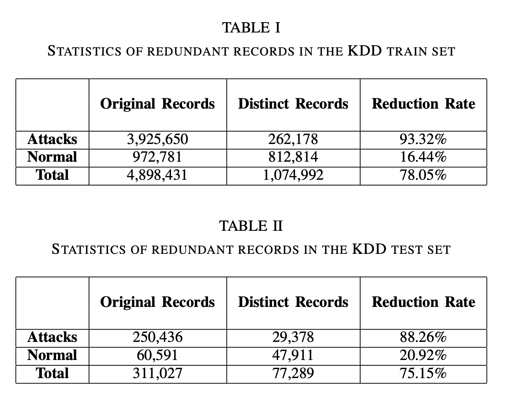
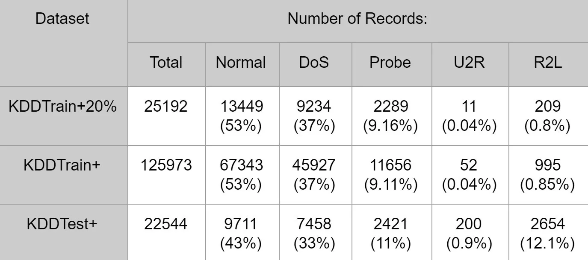

# KDD-Research

This repo is for KDD Dataset Research and Any kinds of Related works.

## What is NSL-KDD Dataset? / 什麼是 NSL-KDD Dataset?

- NSL-KDD Dataset 是 KDD'99 Dataset 的修訂版本，並解決了
  - KDD'99 Dataset 中有冗余資料的問題。
  - KDD'99 Dataset 中的測試集有來自訓練集的資料副本的問題。
- 並且有另外兩項優勢
  - 訓練集跟測試集的數量合理，可以穩定的用來評估模型的效能，不需切子集做使用。
  - 問題難度的選擇方法可以讓對於機器學習更難的數據被更多的保留，使得評估模型的效能更加公平。

## The History of NSL-KDD Dataset / NSL-KDD Dataset 的歷史

- NSL-KDD Dataset 是在 2009 年由 UNB (University of New Brunswick) 所整理開發的，旨在解決於 1999 年 KDD Cup 中所使用的 KDD'99 Dataset 中的問題。
- KDD'99 Dataset 則是在 1999 使用在 KDD Cup 1999 年的 計算機網路入侵偵測競賽 中的資料集，由 Stolfo 等人所整理，其數據源自於 1998 年 DARPA (Defense Advanced Research Projects Agency) 所紀錄的 9 週的網路流量，並依照前七週的數據作為訓練集，後兩週的數據作為測試集。
- 而 DARPA 98 則是由 MIT Lincoln Lab 所提供的，其創建目的為調查和評估入侵檢測研究。此環境模擬了典型美國空軍 LAN 的九週原始 TCP 轉存數據，在將此 LAN 視為真正的空軍環境做操作的過程中，也同時對其進行攻擊。
  - 此還環境所遭受的攻擊主要分成四大類：
    - DoS (Denial of Service)：拒絕服務攻擊，主要是透過洪水攻擊 (Flood Attack) 來使目標主機或網路資源無法提供正常的服務。
    - Probe：探查攻擊，主要是透過探查來找出目標主機或網路資源的弱點。
    - R2L (Remote to Local)：遠端到本地攻擊，主要是透過遠端的方式來攻擊本地主機或網路資源。
    - U2R (User to Root)：使用者到高權限使用者攻擊，主要是透過嘗試提升使用者權限來攻擊本地主機或網路資源。
  - 更重要的事情是測試資料中跟訓練資料是有所落差的，在測試資料中有完全不包含在訓練資料中的特定攻擊類型，而且在測試資料中的攻擊類型的比例也與訓練資料中的攻擊類型的比例不同。
    > 此部分讓很多專家認為更貼近真實環境，因為在真實環境中，攻擊者會不斷地創造新的攻擊方式，而且攻擊的比例也會隨著時間的推移而改變。
- 總結：
  - KDD'99 由於是 DARPA 98 的整理版本，因此在攻擊類型上當然是看齊 DARPA 98 的攻擊類型，也分成了四大類。NSL-KDD 又是 KDD'99 的修訂版本，因此也是此四大類攻擊特徵。

## The difference of KDD Data set / KDD Data set 的差異

- KDD 相比一般對於網路流量的收集，提供了共 43 種數據特徵，包含 41 個原始數據特徵，跟一個攻擊類型標籤，以及一個攻擊嚴重性標籤。
- 在 41 種特徵中，又可以分成三大類型，分別是
  - 基礎連線特徵，也就是我們常見關於流量的資訊內容，包含
    1. duration: 連線持續時間
    2. protocol_type: 連線協定
    3. service: 目標主機的服務類型 (所連線的服務)
    4. flag: 連線是否正常或錯誤 (連線狀態)
    5. src_bytes: 來源端傳送到目的端的 bytes 數量
    6. dst_bytes: 目的端傳送到來源端的 bytes 數量
    7. land: 來源端跟目的端是否為同一個 IP 跟 Port
    8. wrong_fragment: 連線中的錯誤片段數量
    9. urgent: 連線中的 urgent 封包數量 (也就是在 packet 中有 urgent bit 的 packet 數量)
  - 連線內容特徵，也就是對於服務的操作互動上的特徵，包含
    1. hot: 連線中的訪問敏感服務/資源的次數
    2. num_failed_logins: 連線中的登入失敗次數
    3. logged_in: 連線中是否有登入成功
    4. num_compromised: 連線中的有多少"被入侵的目標" (compromise indicator) Number of "compromised" conditions
       > 不確定該如何翻譯跟理解
    5. root_shell: 連線中是否有 root shell (root 用戶權限的指令)
    6. su_attempted: 連線中是否有 `su` 指令的使用
    7. num_root (number of "root" accesses): 連線中有多少次 root 權限的操作
    8. num_file_creations (number of file creation operations): 連線中有多少次建立檔案的操作
    9. num_shells (number of shells): Shell 被開啟的次數
    10. num_access_files (number of operations on access control files): 連線中有多少次對 access control files 的操作
    11. num_outbound_cmds (number of outbound commands in an ftp session): 連線中有多少次對 ftp session 的 outbound 指令
    12. is_host_login (is this login a host (not a user) login): 連線中是否有 host login
    13. is_guest_login (is this login a "guest" login): 連線中是否有 guest login
  - 基於時間的特徵，也就是對於連線的時間上的特徵，包含
    1. count: 連線的次數
    2. srv_count: 連線的次數 (server)
    3. serror_rate: 連線中的錯誤封包數量 / 連線中的封包數量
    4. srv_serror_rate: 連線中的錯誤封包數量 / 連線中的封包數量 (server)
    5. rerror_rate: 連線中的錯誤回應數量 / 連線中的回應數量
    6. srv_rerror_rate: 連線中的錯誤回應數量 / 連線中的回應數量 (server)
    7. same_srv_rate: 連線中的相同服務的封包數量 / 連線中的封包數量
    8. diff_srv_rate: 連線中的不同服務的封包數量 / 連線中的封包數量
    9. srv_diff_host_rate: 連線中的不同主機的封包數量 / 連線中的封包數量 (server)
  - 基於主機的特徵，也就是對於連線的主機上的特徵，包含
    1.  dst_host_count: 連線中的目的主機數量
    2.  dst_host_srv_count: 連線中的目的主機數量 (server)
    3.  dst_host_same_srv_rate: 連線中的相同服務的封包數量 / 連線中的封包數量 (目的主機)
    4.  dst_host_diff_srv_rate: 連線中的不同服務的封包數量 / 連線
    5.  dst_host_same_src_port_rate: 連線中的相同來源端口的封包數量 / 連線中的封包數量 (目的主機)
    6.  dst_host_srv_diff_host_rate: 連線中的不同主機的封包數量 / 連線中的封包數量 (目的主機)
    7.  dst_host_serror_rate: 連線中的錯誤封包數量 / 連線中的封包數量 (目的主機)
    8.  dst_host_srv_serror_rate: 連線中的錯誤封包數量 / 連線中的封包數量 (目的主機 server)
    9.  dst_host_rerror_rate: 連線中的錯誤回應數量 / 連線中的回應數量 (目的主機)
    10. dst_host_srv_rerror_rate: 連線中的錯誤回應數量 / 連線中的回應數量 (目的主機 server)
  - 最後則是標籤跟等級，包含
    1.  class: 連線的類別，是 `normal` (正常) 還是 `anomaly` (異常)
    2.  difficulty_level: 連線的難度等級
- 依照這樣去對資料做細分是有意義的，
  - 首先是 "封包基本連線特徵"，這很好理解，本來 Traffic 中就會有這些資訊，而且理論上互動上來說怎樣才算是 "符合預期" 在這個領域上是有一定的共識的，所以這部分的特徵是比較好理解的
  - 其次是 "封包內容特徵"，這部分可以算是對於 R2L 跟 U2R 這兩種攻擊型態所專屬的特徵狀況，由於相較於其他兩種攻擊型態，往往會由大量且多個 packets 所組成，R2L 跟 U2R 往往只有一個 packet 所攜帶的 payload 就屬於一個操作了，所以歸納了這類型的特徵。
  - 再來是對於連續封包的特徵，分別有 "基於時間" 跟 "基於同服務"，兩者分別希望做到的事情是
    - 基於時間，主要是希望統計在一個時間區間內環境所發生的各種狀態 (2 sec)，如 "連線次數"，這樣的特徵能有助於我們辨識環境是否遭掃描或者是有其他異常的狀況發生。畢竟很多行為光靠單一封包是無法判斷的，所以需要一些時間上的累積。
    - 基於服務，也是類似於時間的概念，只是改成希望針對單一服務的狀況做統計，如 "連線中的目的主機數量"，這樣的特徵能有助於我們解決辨識超過 2 秒鐘的數據特徵，能抓出例如 時間間隔較大的探測攻擊。
- 可以發現基於上述四大種類的特徵，會允許我們辨識出不同種類的攻擊樣態，而不會過度偏頗於某一種類型的攻擊。

## Why there is NSL-KDD dataset? / 這個資料集的存在意義

- 上面有提到 NSL-KDD 資料集是希望解決 KDD'99 資料集的固有問題，又由於 KDD'99 是直接由 DARPA'98 資料集所轉換而來的，因此 KDD'99 繼承了部分 DARPA'98 的問題，也改進了一些問題，因此我們先一層一層討論這些數據集的問題。
- 關於 DARPA'98 中的問題，可以分成三個大方向
  - 數據混雜、可信度存疑
    > 出於一些考量，實驗者直接將背景數據跟攻擊數據進行了綜合，並宣稱這些背景數據跟多個空軍基地的採樣數據是相似的，但實際上 1. 沒有對數據的誤報性作過濾分析， 2. 合成後的數據附載量明顯跟真實流量不相似。
  - 流量過高、數據丟失
    > DARPA'98 使用了 TCPdump 等流量收集工具，但這些工具在收集大量數據時會有丟包的問題，但其數據檢查完全沒有驗證此類可能性。
  - 定義不明、規定不善
    > 攻擊定義不明確，舉例來說針對掃描這個攻擊行為來說，往往是這類型的行為要過某一個特定的時間閥值才會算是惡意行為，而非有這樣的行爲就是 (大量詢問 IP 位址在 ICS 場域中要找到正確的 PLC 就時常發生)，但在 DARPA'98 的 Lab 中，這樣的行為就被定義為掃描攻擊。
- DARPA'98 還有更嚴重的數據問題，包含一些錯誤的明顯特徵，例如 TLL (Time to Live) 這個特徵中的 126 跟 253 只出現在惡意流量中，而揉合進去的背景流量此數值則大多是 127 和 254，還有其他如特定 IP 跟 Port 都只出現在惡意流量中，這些都是明顯的錯誤特徵，但在 DARPA'98 中卻沒有被檢查出來。
- 回頭來看看 KDD'99 時，則可以發現一個好消息，就是上述的狀況大多有意或無意地被 KDD 的 41 種特徵統計所解決了，但 KDD 中也出現了 DARPA 資料集中沒有的問題，分別有
  - 數據極度不平均，這邊個不平均不只是在數據載資料集的分佈上，也在比例上
    > 舉例來說，_smurf_ attacks (一種 DoS 攻擊) 跟 _neptune_ attacks (另一種 DoS 攻擊) 這兩種攻擊，在將數據及切分成十等份之後，基本上完全佔據第八第九等分的數據。
    > 而且此類數據在 KDD'99 中佔了 70% 以上的數據，而其他攻擊行為的數據則佔了 30% 以下，這樣的數據分佈會造成許多問題。而且說實話由於此類攻擊的特徵真的太過於明顯了，因此其實很容易通過其他檢測方式就能夠辨識出來，根本無須用到異常檢測系統。
    > 
  - 測試集跟訓練集的高度重複問題。
- NSL-KDD 則是希望解決 KDD'99 中最大的第一個問題，冗余資料超級多，這會基本上一定會造成機器學習上必定會發生的數據偏差，而且由於我們可以想像到造成此類數據的往往是 DoS 跟 Probe，模型對於危害等級更高的 R2L 跟 U2R 就會更難學習，此外，在測試集中的重複資料也會造成嚴重的偷看效果，讓模型更傾向於被頻繁紀錄的數據。
- 而 NSL-KDD 利用刪除了 "所有" 重複資料來解決資料重複性問題，並結合他們的評估法，反向採樣了數據比例，讓更不容易被辨識的資料更多的被保留。

## Summary of NSL-KDD / NSL-KDD 的總結

- KDD Dataset 的整理方式已經解決了 DARPA Dataset 在上的一些問題，包含
  - 數據混合
  - 封包丟失
  - 定義不明確
- 而 NSL-KDD 則針對 KDD'99 又生成的問題做了修正，包含
  - 數據極度不平均
  - 測試集跟訓練集的高度重複問題
- 因此理論上 NSL-KDD 是一個適合用來做 IDS 的資料集...嗎？

## What I think about NSL-KDD / 我對於 NSL-KDD 的看法

- 我的疑惑：
  - KDD Dataset Format 在沒有針對 DARPA Dataset 做任何處理的狀況下，就能解決 DARPA Dataset？
  - NSL-KDD Dataset 在仍然是 KDD'99 的 Subset 的狀況下，一樣解決了 KDD'99 Dataset 的問題？
- 先來看看 NSL-KDD Dataset 中的數據分佈狀況，
  > 
  > from [Most Important things of "NSL-KDD" data set - Lasitha Hiranya](https://medium.datadriveninvestor.com/did-you-know-the-famous-data-set-called-nsl-kdd-293b39420c74)
  - 數據不平衡的問題基本上其實完全沒有被解決， U2R + R2L 的總和 % 還是沒超過 13%，佔攻擊比例中的不到三成，這樣的數據仍然是對於檢測出 R2L 跟 U2R 來說是不夠的。
  - NSL-KDD 成功的解決了冗余資料，但問題是解決冗余資料真的會讓 Dataset 更真實嗎？我個人認為如果這些冗余資料是屬於 Normal Data 的部分，那可能完全不會，原因是我們不能要求真實的場域在攻擊數據的比例上跟正常數據近似，甚至還超過正常數據，這對正常有在控管的場域來說是不可能的。從上圖也可以看到攻擊數據在 `KDDTrain+` 跟 `KDDTest+` 數據中，是超過正常數據的，這樣的數據分佈是不可能在真實的場域中發生的。
- 使用上來說，利用 NSL-KDD Dataset 所訓練出來的模型是否有機會於一般場域中做使用？答案是很難，KDD Dataset Format 將 Traffic 的 Time-series 特徵跟問題解決了，每一筆 Data 在 KDD 中都代表著一個行為、狀況，那訓練出來的 Model 怎麼針對實際場域做實時的檢測，很難。
- 所以會不會其實 NSL-KDD 數據集仍然存在很許多 DARPA Dataset 遺留下來的問題，也仍然有很多本身所創造出來的問題，但這不影響 NSL-KDD 仍然是目前非常重要的網路流量公開訓練資料集。

## What I'm trying to use about NSL-KDD Dataset / 我想要用 NSL-KDD Dataset 做什麼
